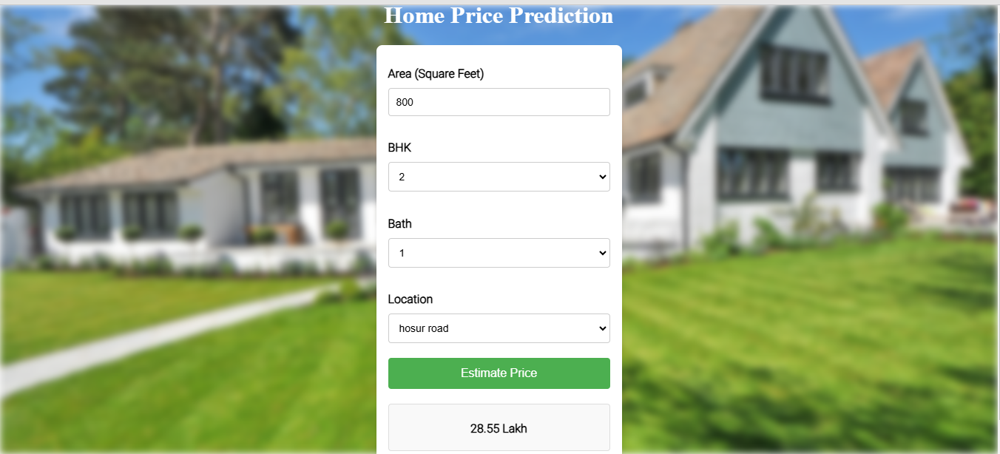

# Home-Price-Prediction-Model

Welcome to the Real Estate Price Prediction project! This repository contains a step by step process of how to build a web application that predicts real estate prices using machine learning techniques. The project is structured into three main components: model building, server setup, and user interface development.

# Project Overview
This project will walk you through the following steps:
Model Building: Utilize the Bangalore home prices dataset from Kaggle to build a predictive model using scikit-learn and linear regression. The model will incorporate several key data science concepts, including:
            Data loading and cleaning
            Outlier detection and removal
            Feature engineering
            Dimensionality reduction
            Hyperparameter tuning using GridSearchCV
            K-fold cross-validation
Flask Server: After building the model, create a Python Flask server that serves HTTP requests. This server will handle incoming data from the user interface and return predicted prices based on the input features.
User Interface: The final component is a web interface built with HTML, CSS, and JavaScript. This interface will allow users to input details such as square footage, number of bedrooms, and other relevant features to retrieve predicted home prices.

# Technologies and Tools Used
This project utilizes a variety of technologies and tools, including:
            Python: The primary programming language for data processing and model building.
            NumPy and Pandas: For data cleaning and manipulation.
            Matplotlib: For data visualization.
            Scikit-learn: For building the machine learning model.
            Jupyter Notebook, Visual Studio Code, and PyCharm: As integrated development environments (IDEs).
            Flask: To create the web server.
            HTML/CSS/JavaScript: For developing the user interface
